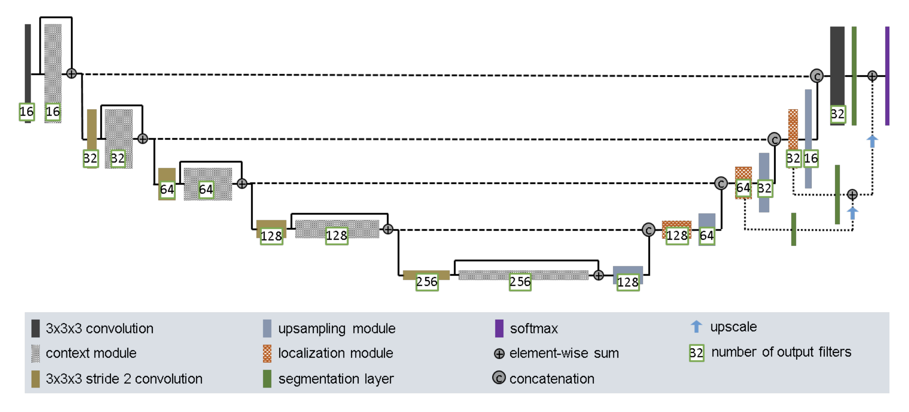
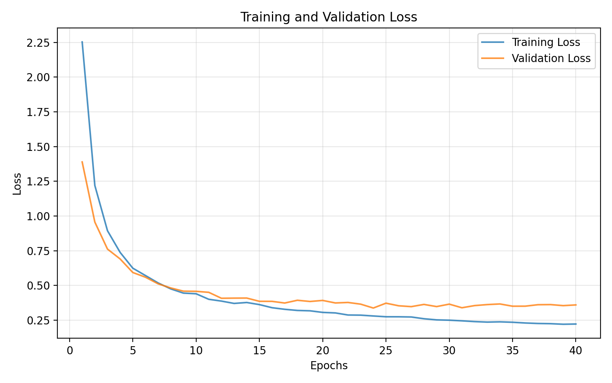

# Improved 3D U-Net
**Author:** Kartik Bandiwadekar  
**Date:** October 2025  

---

## Introduction

U-Net is a convolutional neural network architecture designed for image segmentation. It follows an encoder–decoder structure, where the encoder progressively down-samples the input to extract semantic features, and the decoder reconstructs the segmentation map from these compressed representations [1]. Skip connections link corresponding encoder and decoder stages, transferring high-resolution contextual information that improves localization and boundary accuracy.

The 3D U-Net extends this framework to volumetric data. It replaces 2D convolutions and pooling operations with their 3D counterparts, allowing the network to capture spatial relationships across depth, height, and width [2].

The Improved 3D U-Net enhances this baseline with several architectural modifications, including pre-activation residual blocks, instance normalization, dropout, and deep supervision. These components improve gradient flow, training stability, convergence speed, and generalization performance.

---

## Problem

3D image segmentation is useful for medical imaging, specifically 3D MRI scans [3]. the model described below was made to segment the Prostate 3D MRI dataset, used for the HipMRI Study on Prostate Cancer. 

---

## Model

Both the encoder and decoder employ a Pre-activation Residual Block, designed to enable stable training and efficient feature reuse. Each block applies Instance Normalization and a ReLU activation before a 3 × 3 × 3 convolution. A dropout layer is inserted between the two convolutions to mitigate overfitting. The input is then added to the output through a residual connection; if the channel dimensions differ, a convolution 1 × 1 × 1 aligns them before summation.

### Encoder

In the encoder, each block extracts higher-level features and reduces spatial resolution via max pooling, passing compact representations to the next stage while retaining intermediate outputs for skip connections.

### Decoder

The decoder performs the reverse process. Transposed convolutions upsample the feature maps, which are concatenated with corresponding encoder features via skip connections to recover spatial detail. Each concatenated feature map is then processed by a residual block to refine the predictions.

### Improved 3D U-Net

In general, the Improved 3D U-Net integrates these components into a symmetric encoder–decoder structure with a bottleneck layer at its center. The encoder captures hierarchical feature representations, while the decoder reconstructs fine-grained segmentation maps using the rich contextual cues preserved through skip connections.

### Loss Function

The model uses a combined Dice and Weighted Cross Entropy loss. This combination allows the model to balance overlap accuracy with voxel-wise class precision.

**Dice Loss:**

$$
\text{DiceLoss} = 1 - \frac{2 \cdot |A \cap B|}{|A| + |B|}
$$

where \(A\) represents the predicted segmentation and \(B\) represents the ground truth. This loss focuses on the similarity between the prediction and the target, making it useful when a class imbalance exists.

**Cross Entropy Loss:**

$$
L_{CE} = -\frac{1}{N}\sum_{i=1}^{N}\sum_{c=1}^{C} w_c \, g_{i,c}\log(p_{i,c})
$$

where \(w_c\) is the weight of the class, \(g_{i,c}\) is the ground truth label, and \(p_{i,c}\) is the predicted probability that voxel \(i\) belongs to class \(c\) [7].  
Weights were determined by how much a class dominated training in a CE loss training without dice.

**Final Combined Loss:**

$$
L_{total} = L_{Dice} + L_{CE}
$$

For deep supervision, losses are also computed on intermediate decoder layers. Each layer output contributes to the total loss with a decaying weight:

$$
L_{DS} = \sum_{k=1}^{K} \alpha_k \left( L_{Dice}^{(k)} + L_{CE}^{(k)} \right)
$$

The combined DiceCE loss was used instead of standard cross entropy because the loss function was dominated by larger segment classes. Dice loss helps correct this by giving equal or higher weighting to smaller regions during optimization.

---

## Dataset

As mentioned above, the model was used on the HipMRI Prostate 3D dataset.  
This dataset consists of several MR images of the male pelvis, labeled weekly [4].  
There were a total of 6 separate segments in the data. The goal was to obtain a Dice Similarity Coefficient (DSC) of more than 0.7 for all segments, provided by the Improved 3D U-Net.

The data comes in two folders: the semantic images and the labels.  
The data was resized from 256×256×128 to 128×128×64 to reduce computational power.  
The default training/validation split was **80 × 10 × 10**, which is a common split prioritizing training results [6].

The test script saves the indexes in the test split in a JSON file. These are the images to be used in the prediction script given a model.

---

## Usage

### Dependencies

The following dependencies are required for running the model and training pipeline:

- **nibabel 5.3.2:** Used to load and process `.nii.gz` medical image files.  
- **torch 2.7.1+cu118:** Provides deep learning framework and GPU acceleration.  
- **scipy 1.16.2:** Used for spatial transformations such as zooming.  
- **numpy 2.1.2:** Supports volumetric MRI array manipulation and saving arrays of plots.  
- **tqdm 4.67.1:** Displays progress bars during training.

### Training the Module

The data loader assumes that the labels and the semantic MRI images are sorted by name.  
[Download the data from the source](https://data.csiro.au/collection/csiro:51392v2?redirected=true), and then use a similar naming scheme:

Name the semantic images so that they map 1-to-1 with the MRI labels.

To run the training script and reproduce results:
- `python train.py --img_dir [image_directory] --lbl_dir [label_directory] --epochs 40`

This will output `DSCSCORES.npy` and `VTLOSSES.npy`, which are NumPy files containing DSCs per class and the validation/test losses respectively.

to run the prediction script, make sure to run train.py once to get a model and JSON file containing the test split, and change the IMAGE_PATH variable at the top of predict to the image you want to process to fallback, then run the following.
- `python predict.py`

This saves predictions in the `predictions_test` directory.

---

## Results

the training saves the model with the lowest training loss, which was achieved at epoch 24. Using the output `.npy` files, the following plots were made:

as expected, the training and validation losses decreased over the amount of epochs. loss suggests that for validation loss, the model was essentially done at ~15-20 epochs. we can verify this using the Dice Similarity Coefficient (DSC) plot over 40 epochs.

The plot shows that a DSC threshold above 0.7 was achieved before five epochs.  
Each class exhibits a generally upward trend, plateauing after ~15 epochs.

---

## Example Outputs

`predict.py` was run on 3 samples in the test set. These were visualized using **MRIcron**, a NIfTI file viewer [5].

The figures below show multi-panel medical image visualizations:

  
  

---

## Discussions

The training saves the model with the lowest validation loss, preventing overfitting.  
An optimal model was reached at epoch = 24, and achieving DSC > 0.7 for all segments was done before 5 epochs.  
Each epoch took roughly 1 minute.

**Validation results for epoch 24:**

| Metric | Train | Validation |
|:-------|:------|:-----------|
| **Loss** | 0.2801 | 0.3373 |
| **Validation DSC scores** |  |  |
| Class 0 |  | **0.9957** |
| Class 1 |  | **0.9829** |
| Class 2 |  | **0.9167** |
| Class 3 |  | **0.9357** |
| Class 4 |  | **0.8651** |
| Class 5 |  | **0.8557** |

this implies that the module trained effectively segments the MRI Prostate Dataset. however, at such a high number of epochs, some overfitting may have been done, which can be seen in the loss plot, the validation loss trends higher at epoch~15. this implies that the model stopped learning meaningful features and started fitting towards the test dataset.
---

## References

- [1]  **GfG Editorial Team** (2025) *U-Net Architecture Explained*. GeeksforGeeks, 9 October.  
  Available at: [https://www.geeksforgeeks.org/machine-learning/u-net-architecture-explained/](https://www.geeksforgeeks.org/machine-learning/u-net-architecture-explained/) (Accessed: 27 October 2025).

- [2]  **Xiao, Z., Liu, B., Geng, L., Zhang, F. and Liu, Y.** (2020) ‘Segmentation of lung nodules using improved 3D-UNet neural network’, *Symmetry*, 12(11), p.1787.  
  doi:[10.3390/sym12111787](https://doi.org/10.3390/sym12111787).  
  Available at: [https://www.mdpi.com/2073-8994/12/11/1787](https://www.mdpi.com/2073-8994/12/11/1787).

- [3]  **Zhang, Y.-D.** (2023) ‘Improved U-Net with attention for medical image segmentation’, *Sensors*, 23(20), p.8589.  
  doi:[10.3390/sensors23208589](https://doi.org/10.3390/sensors23208589).  
  Available at: [https://www.mdpi.com/1424-8220/23/20/8589](https://www.mdpi.com/1424-8220/23/20/8589).

- [4]  **CSIRO** (n.d.) *HipMRI Study: 3D Prostate MRI Dataset*.  
  Available at: [https://data.csiro.au/collection/csiro:51392v2?redirected=true](https://data.csiro.au/collection/csiro:51392v2?redirected=true).

- [5]  **Rorden, C.** (n.d.) *MRIcron: Medical Image Visualization Tool*.  
  Available at: [https://www.nitrc.org/projects/mricron/](https://www.nitrc.org/projects/mricron/).

- [6]  **Sivakumar, M., Parthasarathy, S. and Padmapriya, T.** (2024) ‘Trade-off between training and testing ratio in machine learning for medical image processing’.  
  Available at: [https://pmc.ncbi.nlm.nih.gov/articles/PMC11419616/](https://pmc.ncbi.nlm.nih.gov/articles/PMC11419616/).

- [7]  **Hosseini, S.M.** (2024) *TopK Dice Loss for Medical Image Segmentation*.  
  Available at: [https://bmva-archive.org.uk/bmvc/2024/papers/Paper_897/paper.pdf](https://bmva-archive.org.uk/bmvc/2024/papers/Paper_897/paper.pdf).

---

